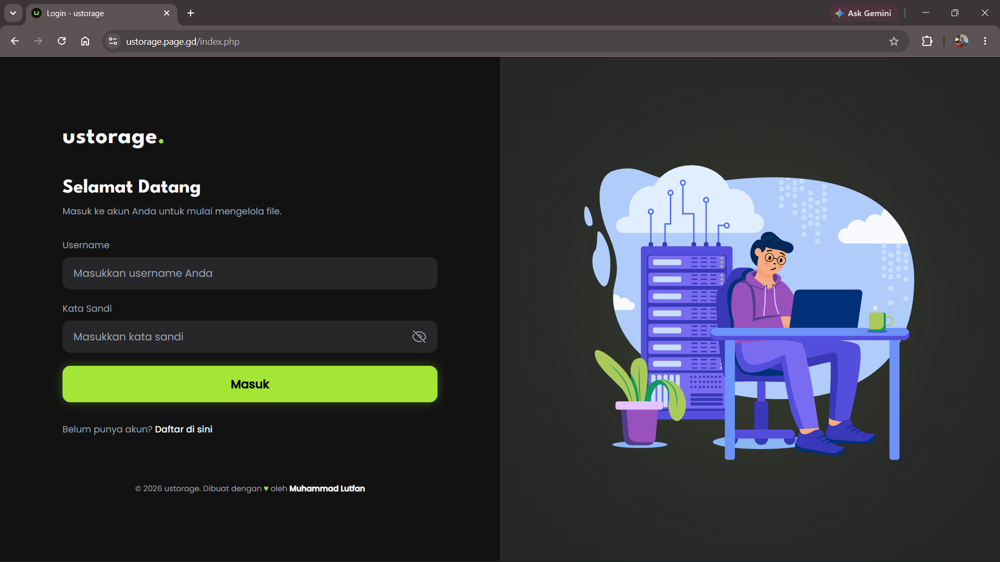
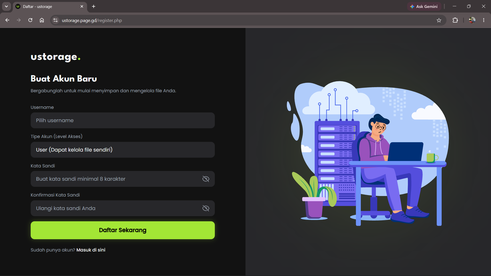
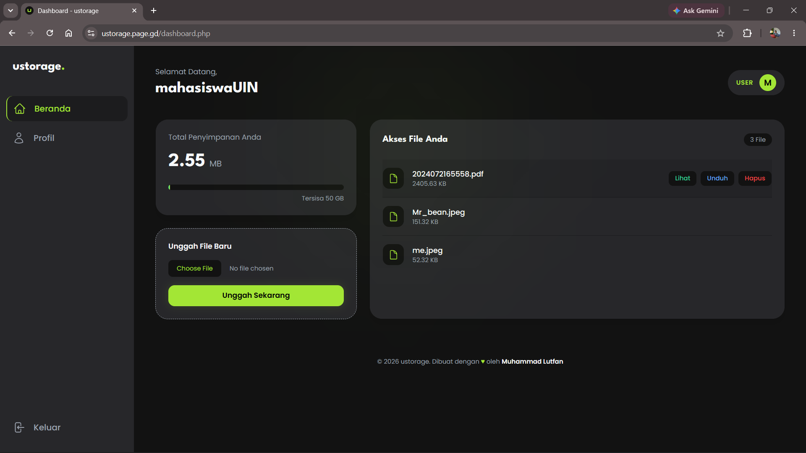
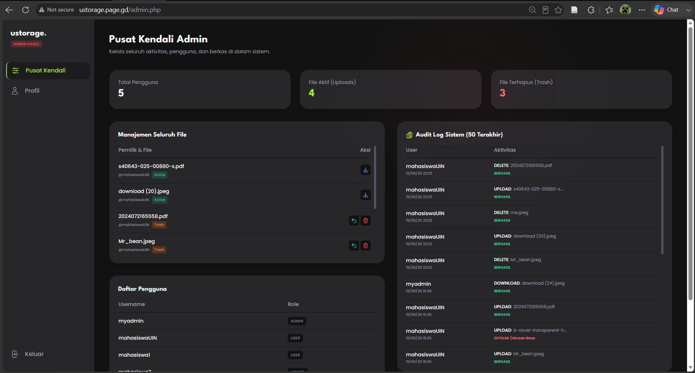
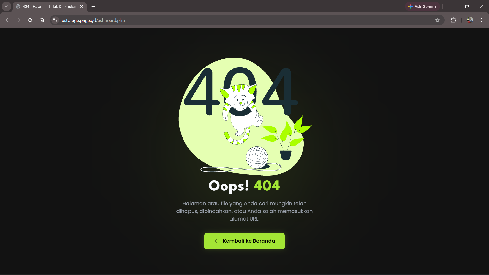

# ustorage - Web-Based Cloud Storage

**ustorage** adalah sistem manajemen berkas (Cloud Storage) berbasis web yang dirancang dengan antarmuka modern dan sistem keamanan yang terstruktur. Proyek ini dikembangkan sebagai implementasi praktis dari prinsip *Human-Computer Interaction* (HCI) menggunakan tata letak *bento-grid* dan tema *dark-neon*, serta difokuskan pada otorisasi pengguna berlapis dan pencatatan riwayat sistem (*Audit Trail*).

---

## Fitur Utama

* **Role-Based Access Control (RBAC):** 
  Pembatasan hak akses yang ketat menjadi 3 level:
  * **Admin:** Memiliki kontrol penuh, memantau *audit log*, mengelola pengguna, dan melakukan *Restore* / *Hard Delete* berkas.
  * **User:** Dapat mengunggah, mengunduh, melihat (*preview*), dan melakukan *Soft Delete* pada berkas pribadi.
  * **Viewer:** Akses *read-only* untuk melihat dan mengunduh berkas tanpa hak modifikasi.
* **Audit Trail (Log Sistem):** Pencatatan otomatis setiap aktivitas krusial (Login, Upload, Download, Delete, View) untuk transparansi keamanan.
* **Safe Deletion System:** Fungsionalitas *Soft-Delete* yang memindahkan berkas ke folder *Trash* sebagai jaring pengaman sebelum dihapus permanen (*Hard-Delete*) oleh Admin.
* **Dynamic Progress Bar:** Indikator visual *real-time* yang mengkalkulasi dan menampilkan sisa ruang penyimpanan pengguna.
* **Modern UI/UX:** Antarmuka responsif menggunakan Tailwind CSS, dilengkapi animasi *Error 404* interaktif (LottieFiles), dan notifikasi estetik (SweetAlert2).

---

## Tech Stack

* **Backend:** PHP 8.x (*Native*)
* **Database:** MySQL / MariaDB
* **Frontend:** HTML5, CSS3, JavaScript
* **Framework CSS:** Tailwind CSS (via CDN)
* **Libraries Ekstra:** SweetAlert2, DotLottie Player (LottieFiles)

---

## Panduan Instalasi (Local Development)

Ikuti langkah-langkah berikut untuk menjalankan aplikasi ini di komputer lokal (XAMPP/Laragon/MAMP):

### 1. Kloning Repositori
```bash
git clone [https://github.com/MLutfan/ustorage-cloud.git](https://github.com/MLutfan/ustorage-cloud.git)
cd ustorage-cloud
```
### 2. Persiapan Basis Data
Buka phpMyAdmin (biasanya di http://localhost/phpmyadmin).

Buat database baru dengan nama *ustorage*.

Lakukan Import file `database.sql` (jika Anda menyertakan file SQL hasil ekspor) ke dalam database tersebut.

### 3. Konfigurasi Sistem
Masuk ke folder `config/`.

Ubah nama file `database.example.php` menjadi `database.php`.

Buka file tersebut dan sesuaikan kredensial koneksi database Anda:

```PHP
   $host = "localhost";
   $username = "root"; // Sesuaikan dengan user database Anda
   $password = "";     // Kosongkan jika menggunakan XAMPP standar
   $dbname = "ustorage";
```

### 4. Persiapan Direktori Penyimpanan
Karena aturan `.gitignore`, folder penyimpanan berkas tidak ikut terunggah secara penuh. Pastikan Anda memiliki dua direktori ini di dalam root folder proyek:

Buat folder `uploads/`

Buat folder `trash/`

### 5. Jalankan Aplikasi
Akses aplikasi melalui browser Anda:
http://localhost/ustorage-cloud

## Akun Pengujian (Mockup)
(Catatan: Anda bisa menyesuaikan bagian ini dengan data akun tiruan yang sudah Anda buat di database)

Admin: Username: myadmin | Password: password123

User: Username: mahasiswa1 | Password: password123

Viewer: Username: viewonly | Password: password123

## Struktur Direktori Utama
```Plaintext
ustorage-cloud/
├── assets/                 # Aset statis (gambar, favicon)
├── config/                 # Konfigurasi sistem (database.php)
├── uploads/                # Tempat penyimpanan berkas aktif
├── trash/                  # Tempat penyimpanan berkas soft-delete
├── index.php               # Halaman utama / Login
├── register.php            # Halaman pendaftaran
├── dashboard.php           # Antarmuka untuk User & Viewer
├── admin.php               # Pusat Kendali Administrator
├── profile.php             # Pengaturan akun pengguna
├── 404.php                 # Halaman error interaktif
└── *process.php            # Skrip pemrosesan logika backend (upload, download, auth, dll)
```

## Dokumentasi
### 1. Halaman Login & Register




### 2. Dashboard User


### 3. Dashboard Admin


### 4. Halaman Profil


### 5. Error 404


## Penulis
Dibuat dan dikembangkan oleh Muhammad Lutfan.
Proyek ini disusun sebagai pemenuhan Tugas Akhir / Ujian Akhir Semester.